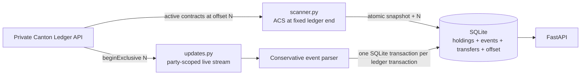

# Canton private ledger scanner

This is a small, resumable indexer for the Cantor8 A1 scanner challenge. It
builds a local view of Canton Coin Holdings and semantic transfers for three
fixed parties by reading the **private Canton Ledger API**. The public Scan API
is not used as the source of scanner history.

## Why a private scanner?

Canton data is disclosed on a need-to-know basis. A participant sees ledger
events for parties it hosts or has rights to, rather than a network-wide public
transaction log. An application that needs fast balances, history, or reports
therefore maintains an off-ledger index of its own authorized view.

This scanner makes that boundary explicit: `/v2/updates` is filtered separately
for each tracked party. A wildcard means every template visible **to that
party**; it does not mean every party or event on the participant.

## Architecture



The startup order is intentional:

1. `scanner.py` reads the ledger end once.
2. It reads every tracked party's Active Contract Set at that exact offset.
3. It commits all current Holdings and the same offset atomically.
4. `updates.py` streams from `beginExclusive` at the saved offset.

Starting the stream with a zero balance would be incorrect. Re-running
`scanner.py` against an initialized database is a safe no-op; normal restarts
go directly to `updates.py`.

## Persistence and correctness

`scanner.db` contains:

- `holdings`: current active Holding contracts.
- `scanner_state`: the latest processed private ledger offset.
- `holding_history`: low-level create/archive accounting effects.
- `private_events`: durable raw private events useful after participant pruning.
- `transfers`: only confidently reconstructed semantic transfers.

For each live ledger transaction, Holding changes, raw events, semantic
transfers, and the offset commit together. A failure rolls all of them back.
Offsets only move forward, so reconnect replay cannot resurrect an older
Holding state.

The live request combines two filters per tracked party:

- the token `Holding` interface with its interface view, used to maintain
  balances;
- a party-scoped wildcard, used to see other authorized private exercises.

A consumed contract is handled whether Canton represents it as an
`ArchivedEvent` or as a consuming `ExercisedEvent` under
`TRANSACTION_SHAPE_LEDGER_EFFECTS`.

## Transfer reconstruction

The scanner does **not** infer a transfer from “Holding archived + Holding
created.” Those effects can also be minting, burning, locking, fees, or another
token operation.

A row enters `transfers` only when a private `TransferFactory_Transfer` exercise
contains an explicit, valid sender, receiver, positive amount, and optional
instrument. Every visible event is still preserved in `private_events`, so the
parser can be extended later without depending on already-pruned participant
history.

## Setup

Python 3.10+ is sufficient. The Ledger HTTP client in `c8lab.py` uses the
standard library; the live scanner and API need three small packages.

```bash
python3 -m venv .venv
source .venv/bin/activate
python -m pip install -r requirements.txt
```

DevNet credentials are expected in the existing ignored `.env`. Load them into
the shell without printing them:

```bash
set -a
source .env
set +a
```

Never commit `.env`, `scanner.db`, tokens, or `C8_CLIENT_SECRET`. Do not use
`c8lab.py check` on DevNet; it walks too many parties. The scanner uses only the
three fixed prefixes in `scanner.py` and `updates.py`.

## Run the demo

Terminal 1, first run only:

```bash
source .venv/bin/activate
set -a; source .env; set +a
python scanner.py
python updates.py
```

After the ACS has been bootstrapped, restart directly from the saved offset:

```bash
source .venv/bin/activate
set -a; source .env; set +a
python updates.py
```

Terminal 2:

```bash
source .venv/bin/activate
uvicorn api:app --reload
```

Then query a full party ID or an unambiguous prefix:

```bash
curl http://127.0.0.1:8000/health
curl http://127.0.0.1:8000/balance/00209eb9a1e8485ba9a7383aa6115ab2
curl http://127.0.0.1:8000/history/00209eb9a1e8485ba9a7383aa6115ab2
```

Endpoints:

- `GET /health` — readiness and latest indexed offset.
- `GET /balance/{party}` — current Decimal-aggregated balances.
- `GET /history/{party}` — semantic transfers with `sent`, `received`, or
  `self` direction and counterparty.
- `GET /debug/holding-history/{party}` — low-level Holding effects.
- `GET /docs` — generated interactive API documentation.

## Tests

The tests use temporary SQLite databases and synthetic private Ledger API JSON;
they never need DevNet credentials or modify the real `scanner.db`.

```bash
python -m unittest discover -s tests -v
python -m py_compile database.py scanner.py updates.py api.py c8lab.py
```

Coverage includes Holding create/archive, consuming exercises, semantic and
non-semantic exercises, raw-event persistence, atomic rollback, replay
idempotency, monotonic checkpoints, prefix resolution, exact Decimal balances,
tree/list transaction envelopes, and restart request construction.

## Known limitations

- The participant reported private history pruned before approximately offset
  `2909305`. Transfers before the scanner's starting point cannot be recovered
  from this participant.
- The current local database was bootstrapped around offset `2920767`; no
  qualifying post-bootstrap `TransferFactory_Transfer` has yet been observed,
  so semantic history is verified with fixtures but not a successful transfer
  between the three DevNet parties.
- A prior transfer attempt between tracked parties failed with
  `NO_SYNCHRONIZER_ON_WHICH_ALL_SUBMITTERS_CAN_SUBMIT`. Read visibility does not
  imply those parties can submit together.
- The parser intentionally recognizes only the confirmed transfer-factory
  choice. Other token-standard flows should be added only after their private
  event arguments are captured and understood.
- DevNet can be slow during the hackathon. A connection timeout is not, by
  itself, evidence of a parser or persistence failure.

The highest-value next step is to capture one real qualifying private transfer
event for a submit-capable party pair, add it as a redacted fixture, and compare
the resulting API history with the transaction submission response.
