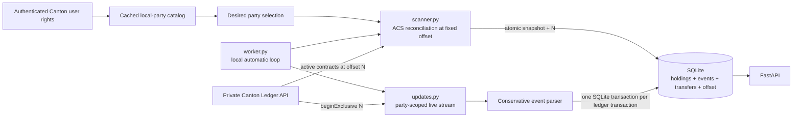

# Canton private ledger scanner

This is a small, resumable indexer for the Cantor8 A1 scanner challenge. It
builds a local view of Canton Coin Holdings and semantic transfers for a
user-selected set of authorized parties by reading the **private Canton Ledger
API**. The original three demo parties remain the fresh-database defaults. The
public Scan API is not used as the source of scanner history.

## Why a private scanner?

Canton data is disclosed on a need-to-know basis. A participant sees ledger
events for parties it hosts or has rights to, rather than a network-wide public
transaction log. An application that needs fast balances, history, or reports
therefore maintains an off-ledger index of its own authorized view.

This scanner makes that boundary explicit: `/v2/updates` is filtered separately
for each tracked party. A wildcard means every template visible **to that
party**; it does not mean every party or event on the participant.

## Architecture



On an empty catalog, `scanner.py` identifies the authenticated Canton user,
lists that user's rights, and caches the readable party catalog. `CanActAs` and
`CanReadAs` add explicit parties. `CanReadAsAnyParty` enables paged party
directory discovery, restricted to `isLocal` parties. Discovery never probes
Holdings.

DevNet's shared party directory can be slow or temporarily return 503. An
existing scanner database does not have to wait for that large refresh: the
managed worker re-reads the authenticated user's rights and, when those rights
still cover every persisted desired/active party, exposes that verified
selection and resumes the live stream. The dashboard reports
`Verified selection · full refresh pending`; the full searchable directory can
be refreshed later. This fallback never invents parties, probes Holdings, or
changes the saved offset. A fresh database still requires a successful catalog
load before its first bootstrap.

The bootstrap order is intentional:

1. The desired selection is loaded from SQLite.
2. `scanner.py` reads the ledger end once.
3. It reads every selected party's Active Contract Set at that exact offset.
4. It commits all current Holdings, active parties, revision, and the same
   offset atomically.
5. `updates.py` streams from `beginExclusive` at the saved offset.

Starting the stream with a zero balance would be incorrect. Re-running
`scanner.py` against an initialized database with no pending selection is a
safe no-op; normal restarts go directly to `updates.py`.

Selection changes are controlled reconciliations. The API updates only the
desired set and revision. The managed local worker notices a pending revision
within five seconds even when the stream is quiet, closes the socket, runs the
scanner at the existing saved offset, and reconnects automatically. The scanner
reads ACS only for additions, removes current Holdings for deselections, and
atomically activates the new revision. Historical events and transfers are
retained. Any ACS error, pruned offset, or revision race rolls the reconciliation
back. In manual mode, `updates.py` still stops cleanly and asks the operator to
run `scanner.py`.

## Persistence and correctness

`scanner.db` contains:

- `holdings`: current active Holding contracts.
- `scanner_state`: the latest processed private ledger offset.
- `holding_history`: low-level create/archive accounting effects.
- `private_events`: durable raw private events useful after participant pruning.
- `transfers`: only confidently reconstructed semantic transfers.
- `party_catalog` and `party_catalog_state`: the cached rights-aware selector.
- `party_selection`: the desired set.
- `tracked_parties`: current/inactive indexing state and transition offsets.
- `scanner_config`: desired and active selection revisions.
- `scanner_runtime_state`: local worker status, heartbeat, connection time, and
  the latest bounded retry error.

For each live ledger transaction, Holding changes, raw events, semantic
transfers, and the offset commit together. A failure rolls all of them back.
Offsets only move forward, so reconnect replay cannot resurrect an older
Holding state.

The live request combines two filters per tracked party:

- the token `Holding` interface with its interface view, used to maintain
  balances;
- a party-scoped wildcard, used to see other authorized private exercises.

A consumed contract is handled whether Canton represents it as an
`ArchivedEvent` or as a consuming `ExercisedEvent` under
`TRANSACTION_SHAPE_LEDGER_EFFECTS`.

## Transfer reconstruction

The scanner does **not** infer a transfer from “Holding archived + Holding
created.” Those effects can also be minting, burning, locking, fees, or another
token operation.

A row enters `transfers` only when a private `TransferFactory_Transfer` exercise
contains an explicit, valid sender, receiver, positive amount, and optional
instrument. Every visible event is still preserved in `private_events`, so the
parser can be extended later without depending on already-pruned participant
history.

## Setup

Python 3.10+ is sufficient. The Ledger HTTP client in `c8lab.py` uses the
standard library; the live scanner and API need three small packages.

```bash
python3 -m venv .venv
source .venv/bin/activate
python -m pip install -r requirements.txt
```

DevNet credentials are expected in the existing ignored `.env`. Load them into
the shell without printing them when using manual commands. On a fresh checkout,
copy `.env.example` to `.env` and replace its placeholders:

```bash
cp .env.example .env
```

Never commit `.env`, `scanner.db`, tokens, or `C8_CLIENT_SECRET`. Do not use
`c8lab.py check` on DevNet; it reads Holdings for thousands of parties. Catalog
discovery pages the native party directory only when the user has
`CanReadAsAnyParty`, filters it to local parties, and caches the result.
Set `C8_USER` to override the Canton user explicitly. Otherwise DevNet uses the
bearer token's `sub`; LocalNet keeps the toolkit's `ledger-api-user` default.

## Run the demo

For the normal local demo, use this single startup flow. The launcher loads the
ignored `.env`, verifies credentials and SQLite without resetting state, then
runs one FastAPI process with one managed scanner worker:

```bash
source .venv/bin/activate
python demo.py --check-only
python demo.py
```

Open <http://127.0.0.1:8000/>. A healthy live demo shows `Live stream
connected`, a changing ledger offset, and the active/desired party counts. A
large-directory outage may also show `Verified selection · full refresh
pending`; this is a safe cached-selection mode and does not stop live indexing.

To use another local port:

```bash
python demo.py --port 8772
```

Then open <http://127.0.0.1:8772/>. Stop the complete API/worker pair with
Ctrl-C. Starting the same command again reuses `scanner.db` and resumes from its
persisted offset rather than rereading the full ACS.

Do not add `--workers`, and do not run `scanner.py` or `updates.py` in another
terminal while the managed worker is enabled. See
[DEMO_RUNBOOK.md](DEMO_RUNBOOK.md) for the presentation sequence, restart proof,
status checks, and non-destructive recovery commands.

On a fresh database, the worker selects the original three demo parties only
when all three are readable. If they are not, the catalog still becomes
available in the browser: unlock selection, choose at least one readable party,
and apply it. The worker then bootstraps that desired set automatically.

The local WebSocket endpoint defaults to the current DevNet URL. Override it
when needed without editing code:

```bash
export C8_WS_URL='wss://your-ledger-host/api/ledger/v2/updates'
```

To refresh the slow party catalog explicitly, stop the API first and run:

```bash
set -a
source .env
set +a
python scanner.py --refresh-parties --catalog-only
```

The default selection limit is 50; set `SCANNER_MAX_PARTIES` before starting
the API to change it. Party browsing is public, but selection mutation is
disabled unless `SCANNER_ADMIN_TOKEN` is configured. The browser keeps an
entered admin token in memory for the current tab only. After changing `.env`,
restart `demo.py` so the API and worker receive the new values.

The original two-terminal workflow remains available for debugging when
`SCANNER_RUN_WORKER` is unset:

```bash
source .venv/bin/activate
set -a; source .env; set +a
python scanner.py
python updates.py
```

Terminal 2:

```bash
source .venv/bin/activate
python -m uvicorn api:app
```

Open `http://127.0.0.1:8000/` for the responsive scanner dashboard shell.
The status rail polls the local health API, pauses in background tabs, keeps the
last good state during transient failures, and displays the local worker status
and heartbeat. The party explorer drives a focused balance and transfer view:
active parties show exact Decimal balances, inactive parties retain semantic
history, and the first history page refreshes when the saved ledger offset
advances.

Then query a full party ID or an unambiguous prefix:

```bash
curl http://127.0.0.1:8000/health
curl http://127.0.0.1:8000/balance/00209eb9a1e8485ba9a7383aa6115ab2
curl http://127.0.0.1:8000/history/00209eb9a1e8485ba9a7383aa6115ab2
```

Endpoints:

- `GET /health` — readiness, latest indexed offset, and local worker runtime.
- `GET /parties?q=&limit=50&offset=0` — cached searchable authorized parties,
  selection state, and catalog metadata; it performs no live Canton calls.
- `GET /parties/selection` — complete desired/active sets and selection limits.
- `PUT /parties/selection` — persist a validated desired set of full party IDs;
  requires the configured scanner admin bearer token.
- `GET /balance/{party}` — current Decimal-aggregated balances.
- `GET /history/{party}?limit=100&offset=0` — paginated semantic transfers with
  `sent`, `received`, or `self` direction and counterparty, total count, and
  current indexing status.
- `GET /debug/holding-history/{party}` — low-level Holding effects.
- `GET /docs` — generated interactive API documentation.

## Tests

The tests use temporary SQLite databases and synthetic private Ledger API JSON;
they never need DevNet credentials or modify the real `scanner.db`.

```bash
python -m unittest discover -s tests -v
node --test tests/test_frontend_status.mjs
python -m py_compile database.py scanner.py updates.py worker.py api.py c8lab.py
```

Coverage includes authenticated-user resolution, rights parsing, paged
local-only discovery, atomic cache replacement, legacy database migration,
selection validation and revisions, exact-offset reconciliation and rollback,
active-only update filters, Holding create/archive, semantic history, replay,
Decimal balances, history pagination and direction, inactive-party history,
quiet-stream revision detection, automatic reconciliation, worker restart and
shutdown, crash consistency, and restart request construction.

## Known limitations

- The participant reported private history pruned before approximately offset
  `2909305`. Transfers before the scanner's starting point cannot be recovered
  from this participant.
- The current local database was bootstrapped around offset `2920767`; schema
  migration seeds its existing Holdings parties as both desired and active
  without changing that offset or rereading ACS.
- A prior transfer attempt between tracked parties failed with
  `NO_SYNCHRONIZER_ON_WHICH_ALL_SUBMITTERS_CAN_SUBMIT`. Read visibility does not
  imply those parties can submit together.
- The parser intentionally recognizes only the confirmed transfer-factory
  choice. Other token-standard flows should be added only after their private
  event arguments are captured and understood.
- DevNet can be slow during the hackathon. A connection timeout is not, by
  itself, evidence of a parser or persistence failure. On an existing database,
  a rights-verified persisted selection can continue streaming while the full
  directory refresh remains pending.

The highest-value next step is to capture one real qualifying private transfer
event for a submit-capable party pair, add it as a redacted fixture, and compare
the resulting API history with the transaction submission response.
